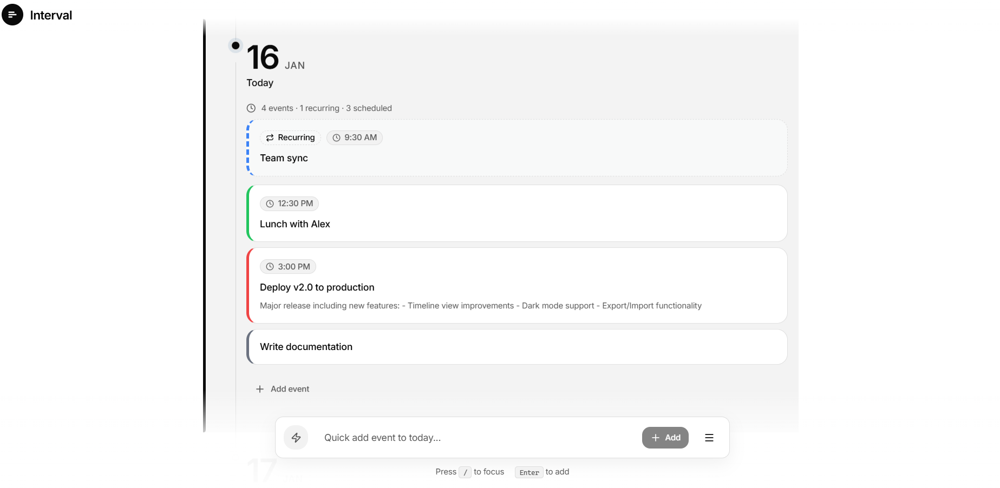
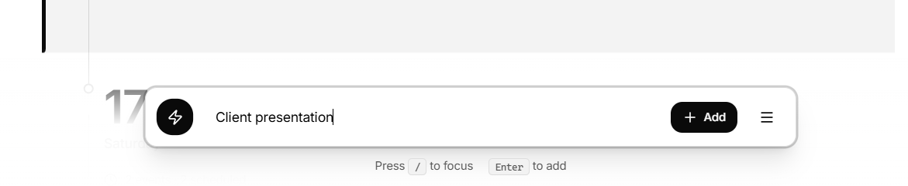
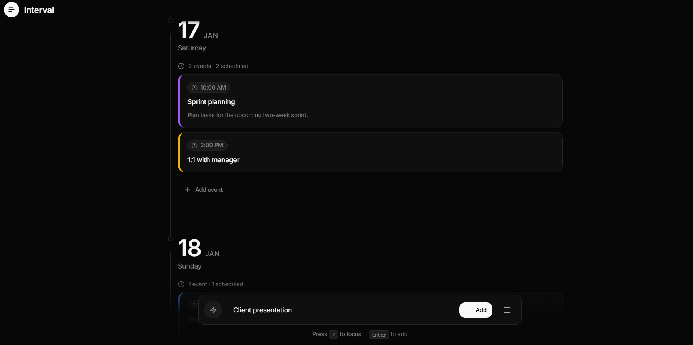
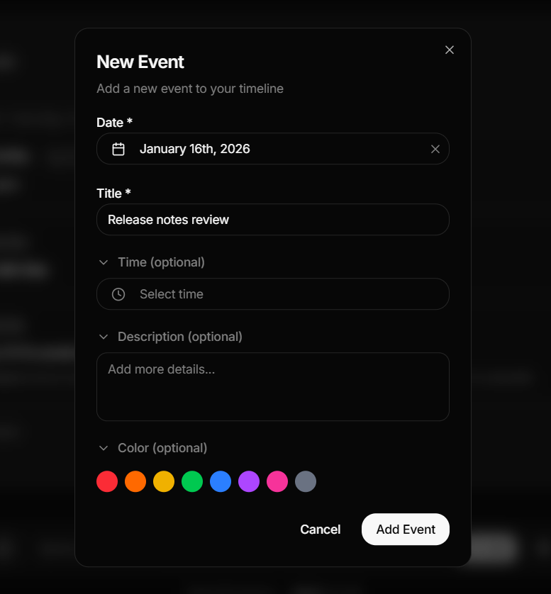
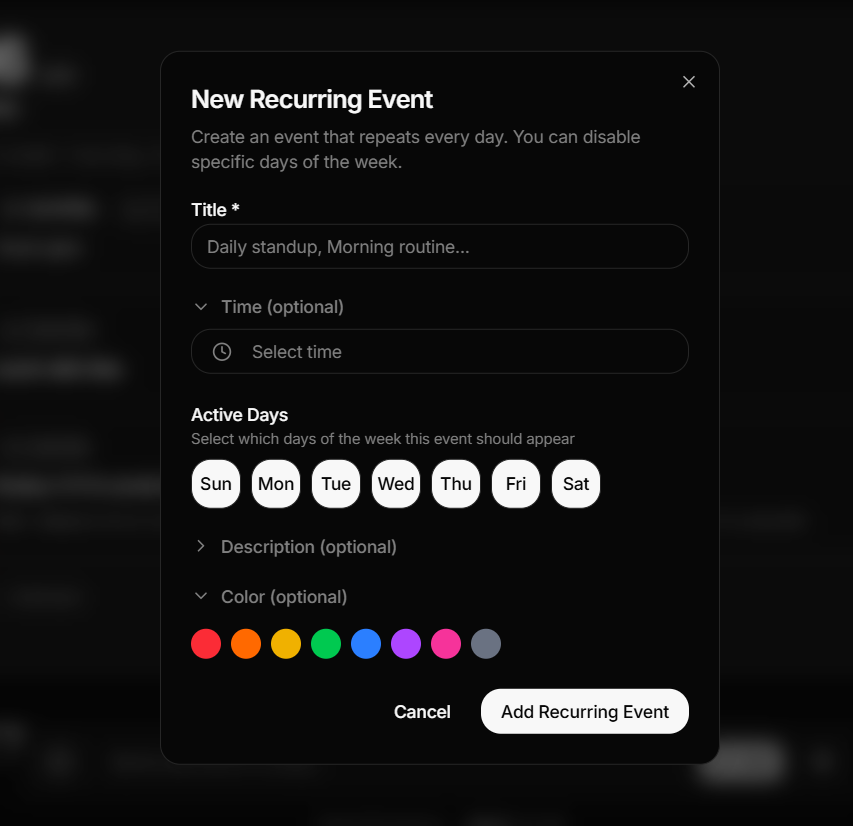
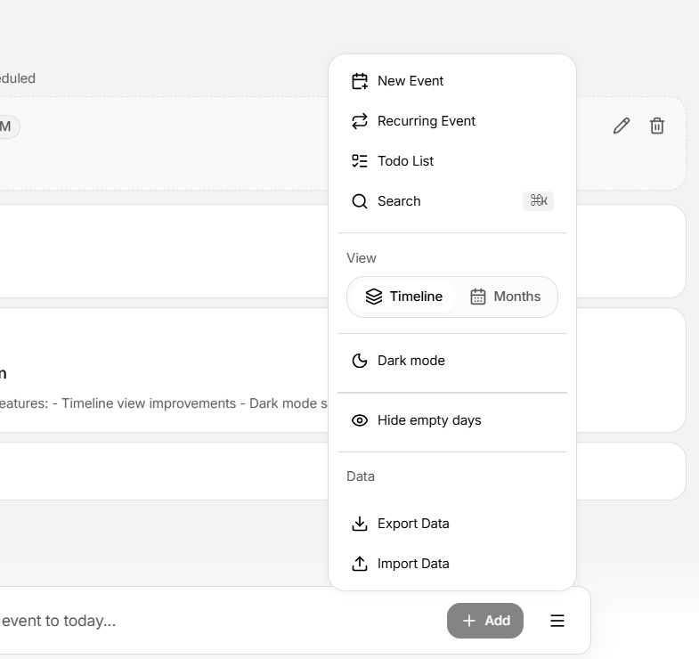

# Interval

A modern, minimalist timeline-based calendar application that provides a vertical timeline alternative to traditional calendars and to-do lists.



## Features

### Timeline View
A continuous vertical timeline that displays your days and events in a natural, scrollable flow. No more grid constraints — just a clean, chronological view of your schedule.

### Quick Add
Rapidly add events to today with a simple keyboard shortcut. Press `/` to focus and start typing.



### Dark Mode
Full dark mode support with a beautiful, high-contrast design.



### Event Management
Create events with optional time, description, and color coding. Everything you need, nothing you don't.



### Recurring Events
Create events that repeat on specific days of the week. Perfect for meetings, habits, and routines.



### Smart Menu
Access all features from a single menu: create events, switch views, toggle theme, and manage your data.



### Additional Features
- **Month View** — Traditional calendar grid view for monthly overview
- **Search** — Search events by title or description (⌘K shortcut)
- **Todo List** — Keep track of tasks not tied to specific dates
- **Data Export/Import** — Backup and restore your data anytime
- **Hide Empty Days** — Focus only on days with events

## Tech Stack

- **React 19** — Latest React with concurrent features
- **TypeScript** — Full type safety
- **Vite** — Lightning-fast development and builds
- **Zustand** — Simple, scalable state management
- **TanStack Virtual** — Efficient virtualization for smooth scrolling
- **Framer Motion** — Fluid animations and transitions
- **Tailwind CSS 4** — Modern utility-first styling
- **Shadcn UI** — Beautiful, accessible component primitives
- **date-fns** — Lightweight date manipulation

## Getting Started

### Prerequisites

- Node.js 18+
- npm or pnpm

### Installation

```bash
# Clone the repository
git clone https://github.com/charredcrow/interval.git

# Navigate to project directory
cd interval

# Install dependencies
npm install

# Start development server
npm run dev
```

### Build for Production

```bash
npm run build
```

### Preview Production Build

```bash
npm run preview
```

## Keyboard Shortcuts

| Shortcut | Action |
|----------|--------|
| `/` | Focus quick add input |
| `⌘K` / `Ctrl+K` | Open search |
| `Enter` | Add event from quick add |
| `Escape` | Close modals/search |

## Project Structure

```
src/
├── components/          # Shared UI components
│   └── ui/             # Shadcn UI components
├── features/           # Feature-based modules
│   ├── events/         # Event management
│   ├── timeline/       # Timeline view
│   ├── month-view/     # Month view
│   └── todos/          # Todo list
├── store/              # Zustand stores
│   ├── timelineStore   # Events & recurring events
│   ├── uiStore         # UI state
│   └── todoStore       # Todos
├── types/              # TypeScript definitions
└── utils/              # Helper functions
```

## Data Storage

Interval stores all data locally in your browser using localStorage. Your data never leaves your device.

### Backup Your Data

1. Click the menu button (☰) in the quick add bar
2. Select "Export Data"
3. Save the JSON file

### Restore Data

1. Click the menu button (☰)
2. Select "Import Data"
3. Choose your backup file

## Design Philosophy

Interval follows a minimalist design approach inspired by modern productivity tools. The interface focuses on:

- **Clarity** — Clean typography and generous whitespace
- **Speed** — Keyboard-first interactions for power users
- **Focus** — No distractions, just your events
- **Privacy** — Local-first, your data stays on your device

## Contributing

Contributions are welcome! Please feel free to submit a Pull Request.

1. Fork the repository
2. Create your feature branch (`git checkout -b feature/amazing-feature`)
3. Commit your changes (`git commit -m 'Add some amazing feature'`)
4. Push to the branch (`git push origin feature/amazing-feature`)
5. Open a Pull Request

## License

This project is open source and available under the [MIT License](LICENSE).

## Acknowledgments

- [Shadcn UI](https://ui.shadcn.com/) for the beautiful component library
- [Lucide](https://lucide.dev/) for the icon set
- [TanStack](https://tanstack.com/) for the virtualization library

---

Made with ❤️ by [CharredCrow](https://github.com/charredcrow)
